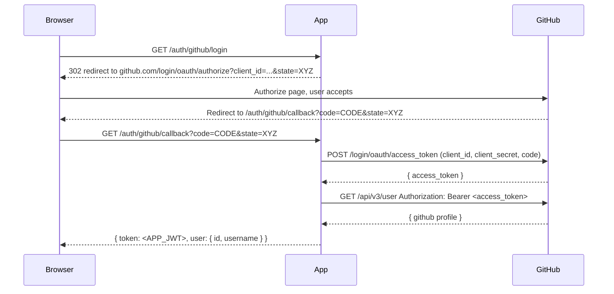
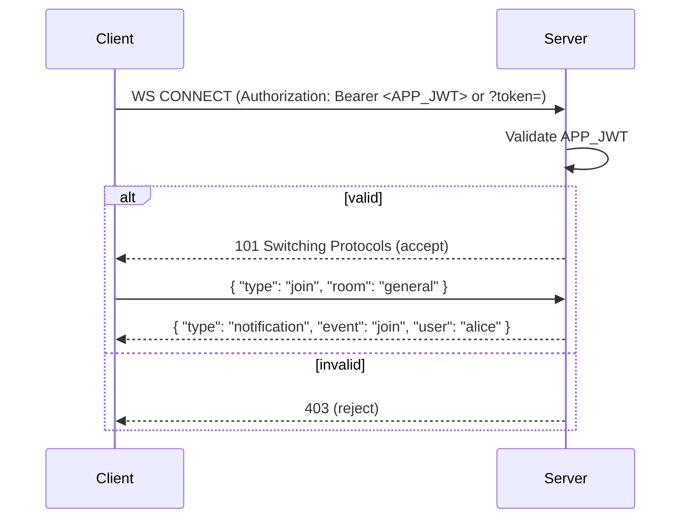

# Django GitHub OAuth + JWT-protected WebSocket Chat PoC

**Goal**: Manual GitHub OAuth (Authorization Code flow) + app-issued JWT and Channels-based WebSocket chat protected by that JWT.

## Features
- `GET /auth/github/login` — starts OAuth flow (creates server-side `state`)
- `GET /auth/github/callback` — exchanges `code` for GitHub token (server-side), fetches profile, creates/updates user, issues app JWT
- `GET /me` — JWT-protected endpoint to return current user
- `ws://.../ws/chat/` — WebSocket endpoint protected by app JWT (Authorization header or `?token=`)
- Tests (OAuth token exchange + profile stubbing, JWT, Channels tests)

## Quickstart (local)

1. Copy `.env.example` to `.env` and fill values (GITHUB_CLIENT_ID, GITHUB_CLIENT_SECRET, JWT_SECRET, DATABASE_URL, REDIS_URL).

2. Create virtualenv & install:

```bash
python -m venv .venv
source .venv/bin/activate
pip install -r requirements.txt
```

3. Run migrations:

```bash
python manage.py migrate
```

4. Run Redis (local or docker) and start dev server (Channels + Daphne recommended):

```bash
# If you have redis locally
daphne -b 0.0.0.0 -p 8000 project_name.asgi:application
# Or using manage runserver (channels provides fallback) — for development only
python manage.py runserver
```

5. Start OAuth (open in browser):

```
GET http://localhost:8000/auth/github/login
```

6. After authorizing on GitHub you'll be redirected to `/auth/github/callback` which returns a JSON containing your app JWT and user info.

## Example curl commands

Start OAuth (this endpoint redirects to GitHub authorize URL):

```bash
curl -v "http://localhost:8000/auth/github/login?next=/"
```

Callback (example only — `code` is normally produced by GitHub after user authorizes):

```bash
curl -v "http://localhost:8000/auth/github/callback?code=<CODE>&state=<STATE>"
```

Get `/me`:

```bash
curl -H "Authorization: Bearer <APP_JWT>" http://localhost:8000/me/
```

WebSocket (wscat example):

```bash
wscat -c "ws://localhost:8000/ws/chat/?token=<APP_JWT>"
# Send join
{ "type": "join", "room": "general" }
# Send message
{ "type": "message", "room": "general", "text": "hi team" }
```

## Running tests

```bash
# pytest recommended (or manage.py test)
pytest
```

## .env.example
See `.env.example` in repo root — DO NOT commit your real secrets.

## Diagrams
Two sequence diagrams included below (Mermaid). See `diagrams/` for ready-to-render mermaid files.

### OAuth flow (Mermaid)



### WebSocket handshake (Mermaid)



---

## Implementation notes & security
- **State**: stored server-side in `OAuthState` with timestamp and 5-minute TTL.
- **No high-level OAuth libraries used.** HTTP calls use `requests` and are unit-tested with `responses` mocking.
- **JWT**: generated with PyJWT. Expiry default 1 hour (configurable). Use `JWT_SECRET` from env.
- **WebSocket auth**: middleware validates JWT either from header `Authorization: Bearer <token>` or `?token=`.
- **Logging**: structured logs for important events. No secrets logged.

---

## Notes, tradeoffs & next steps
- The code uses a simple DB-backed `OAuthState` for server-side `state`. For scaling, you may prefer short TTL entries in Redis.
- JWT blacklisting/refresh flows aren't implemented here; can add refresh tokens and blacklist table if required.
- For production, ensure HTTPS, secure cookies, stricter CORS, and rotate secrets.
# gdg-task
